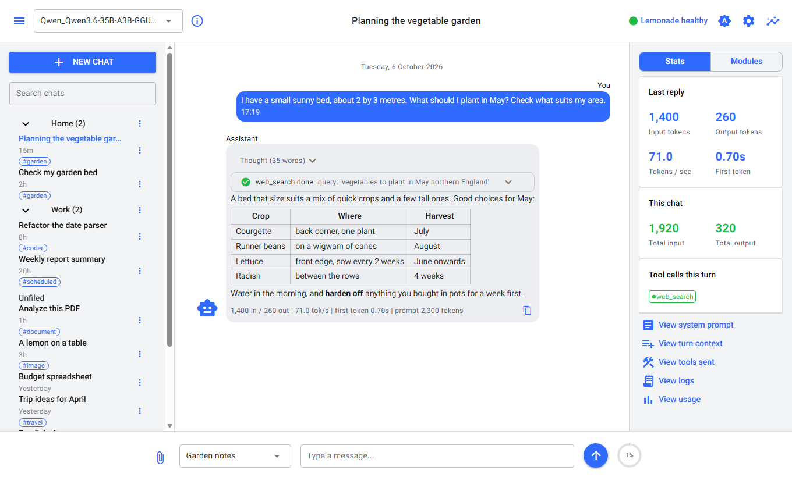
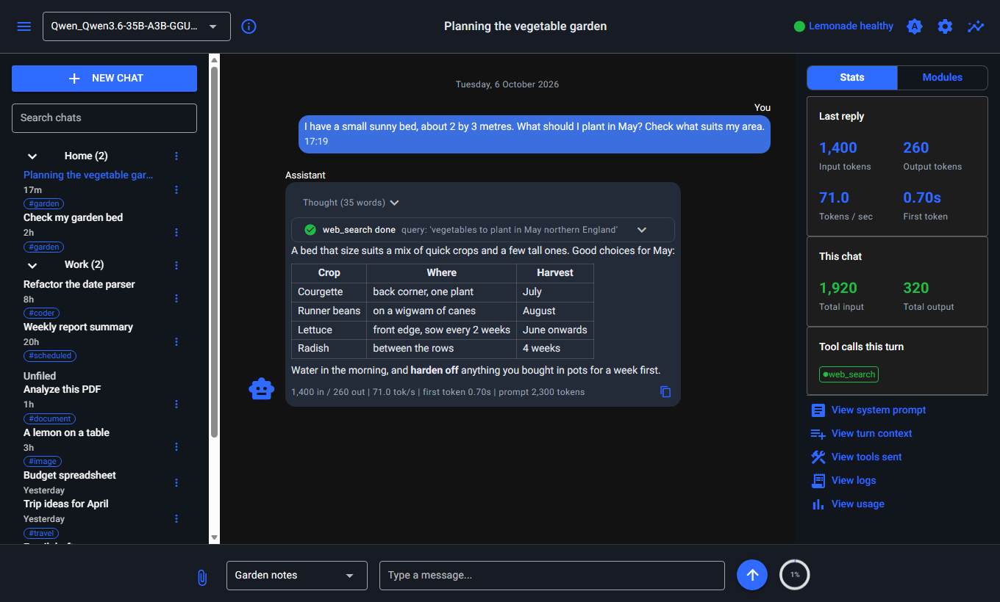
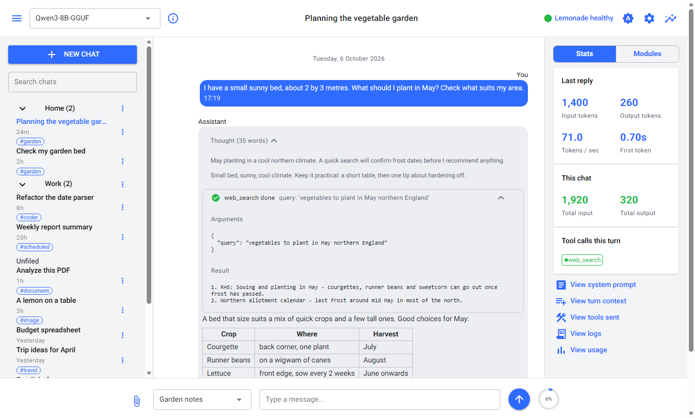
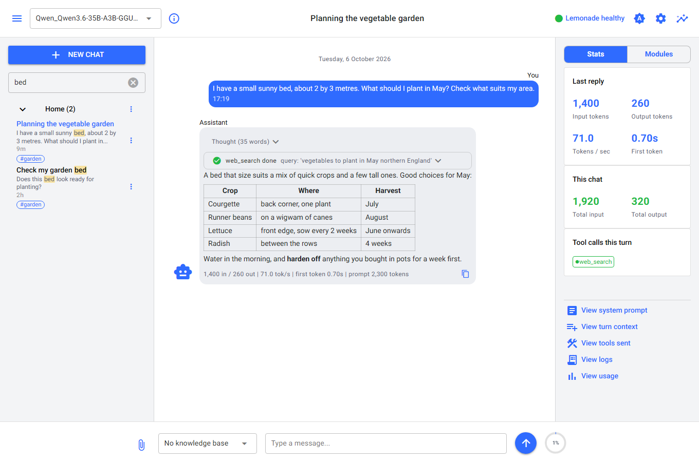
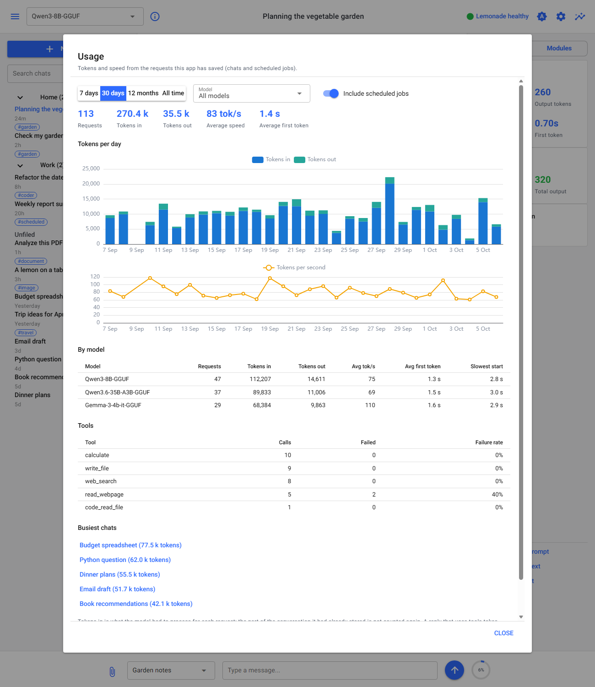
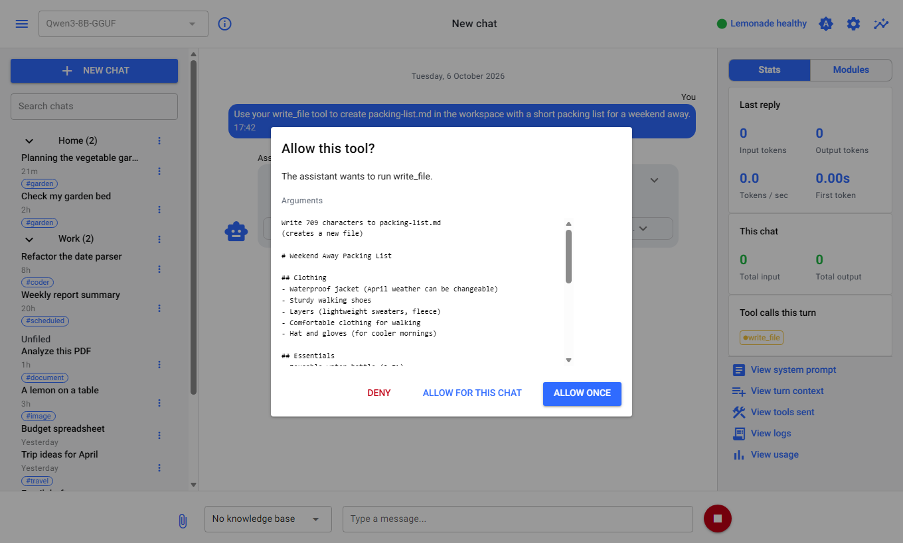
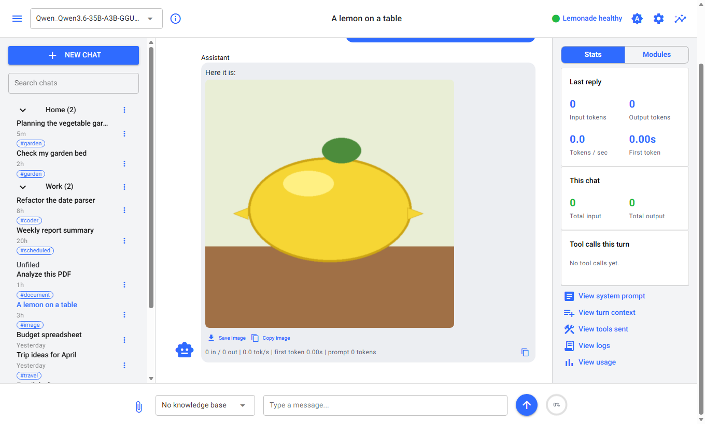
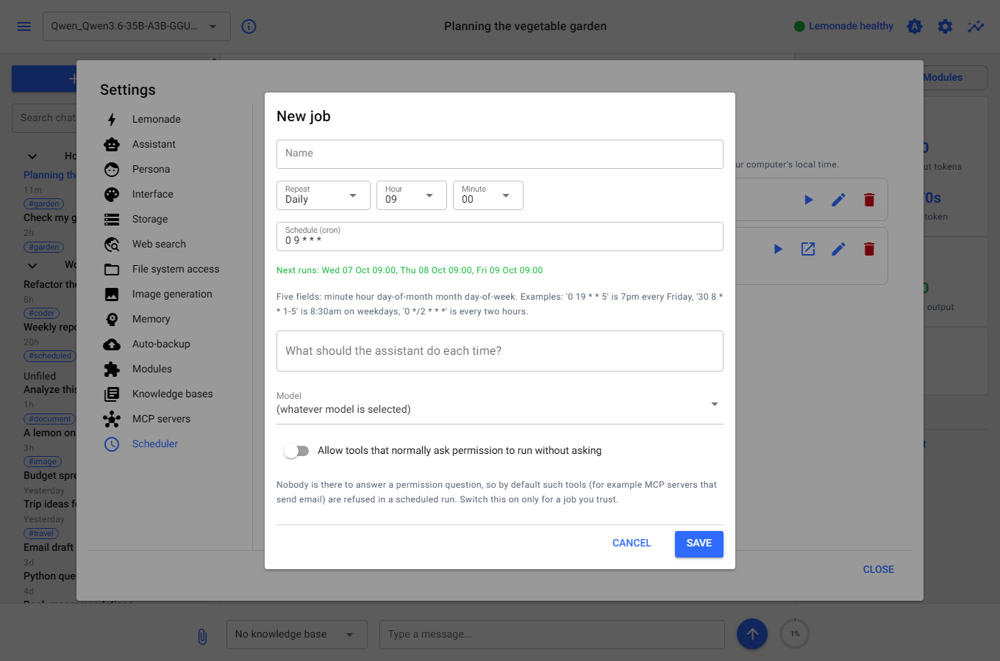

# Lemon Rind

### "All the zest, none of the cloud."

A local AI assistant for [Lemonade Server](https://lemonade-server.ai/), written in Python. Everything runs on your own machine, including the model: your chats, memories and documents
never leave it. Use it in your browser, or in a terminal.

| Light | Dark |
|---|---|
|  |  |

It is a chat with an assistant that can *do* things. It streams its answers and shows its thinking, calls tools (search the web, read and edit files, draw pictures, use other programs
through MCP), remembers lasting facts about you, answers from your own documents, and runs saved jobs on a schedule. Each of those is a switchable module, and every one of them asks
before it does anything that changes something.

Lemon Rind also comes in [WPF, Avalonia and Blazor editions](https://github.com/PCAssistSoftware/LemonRind) (C# and VB.NET) with the same feature set. This is the Python edition, and it started as a learning project: the code is commented to explain the Python ideas as they appear.

## What you need

- **Python 3.12 or newer**
- A running **[Lemonade Server](https://lemonade-server.ai/)** (on this computer or on your network) with at least one chat model downloaded. A model that supports tool calling, such as
  `Qwen3-8B-GGUF`, gives the best results
- Optional, for the modules that use them:
  - an **embedding model** in Lemonade (for example `Qwen3-Embedding-0.6B-GGUF`) for Memory and Knowledge bases
  - a web search service: your own [SearXNG](https://docs.searxng.org/), or an API key for Jina, Tavily or Firecrawl
  - **Node.js**, for MCP servers that start with `npx`

## Run it

### Linux and macOS: one command

```bash
cd LemonRind_Python
bash lemonrind.sh          # creates its own environment on the first run, then starts the web app
```

Then open **http://127.0.0.1:8080**. `bash lemonrind.sh chat` starts the terminal chat instead, and anything else on the line (for example `--port 8090 --no-browser`) goes to the web app.
Starting it with `bash` needs no set-up. If you prefer to type `./lemonrind.sh`, run `chmod +x lemonrind.sh` once first (a file copied from Windows loses its executable permission).

### Windows (PowerShell)

```powershell
cd LemonRind_Python
py -3 -m venv .venv                  # a private environment for this project
.venv\Scripts\Activate.ps1
pip install -e .
lemonrind-web                        # opens your browser; or: lemonrind  for the terminal chat
```

After the first time, running `.venv\Scripts\lemonrind-web.exe` is all it takes. Press Ctrl+C to stop it.

Point it at your Lemonade Server in **Settings > Lemonade**, or on the command line:

```bash
lemonrind-web --base-url http://my-server:13305/v1/
```

The default is `http://localhost:13305/v1/`. 

### Using it from another computer or a phone

By default the web app listens on this computer only. To share it, set a password first, then listen on the network:

```bash
export LEMONRIND_PASSWORD='something long'      # PowerShell: $env:LEMONRIND_PASSWORD = "something long"
lemonrind-web --host 0.0.0.0
```

Every page then asks for the password once. It travels over plain HTTP, so use it on a network you trust. Without a password, listening on the network prints a warning.

## Features

### Chatting

- Streaming replies with a collapsible **thinking** panel for models that reason (it can open by default if you prefer), Markdown with tables and code, a Copy button, and a Stop button
- A **model picker** grouped by kind (Chat, Image, Embedding, Other), read live from Lemonade, with an info button for the model's details and the real launch arguments, and a stopwatch while a
  model loads. Pick an image model and what you type is drawn as a picture
- Statistics for each reply (tokens in and out, speed, time to first token) and for the chat, a **context ring** beside the Send button (hover for the numbers) whose breakdown uses Lemonade's own tokenizer, and
  progress shown while a long prompt is read, and a **usage screen** (tokens and speed over time, per model and per tool, from every request the app has saved)
- **Attachments**: a picture for a vision model, or a PDF, Word, Excel, text or Markdown file to talk about
- Each tool call is shown with its real outcome, and the actual error if it failed
- The model always knows the real date and time
- Viewers for exactly what the model is given: the **system prompt**, the **turn context** (what would be added if you pressed Send now) and the **tools sent**. A **log viewer** shows the app's
  log and Lemonade's own server log, with level and text filters, pause and copy
- Light and dark themes, side panels you can resize by dragging, and a layout that works on a phone

### Modules

Every capability beyond the chat is a module you switch on or off in **Settings > Modules**. A module that is off offers the model no tools at all.

| Module | What it does |
|---|---|
| **Utilities** | the current time and a calculator |
| **Web search** | searches the web through SearXNG, Jina, Tavily or Firecrawl: pick one in Settings |
| **Web reader** | reads one page (the direct reader refuses private network addresses and checks every redirect), or crawls a site when a Firecrawl key is set |
| **File system** | reads and writes files in a workspace folder and any extra folders you allow; writes ask first and show what will change |
| **Coder** | finds, searches, outlines, reads and edits the files of a project folder; edits must match exactly once, are syntax-checked (Python, C#, JSON, TOML, XML; Visual Basic gets a warning) and show a diff before you approve them |
| **Memory** | learns lasting facts about you from your messages and recalls the relevant ones in later chats; reviewable, editable and pinnable in Settings |
| **Knowledge bases** | answers from your own documents: files, folders, web pages and notes, searched by meaning and attached per chat. Each one is a single `.kb` file you can download and add on another computer without re-reading the documents; if the other computer uses a different embedding model, one button re-embeds it |
| **MCP servers** | uses tools from other programs through the Model Context Protocol; paste a server's JSON to add it, and each new server asks permission before each tool use |
| **Images** | draws pictures with an image model on Lemonade, asking first; Save and Copy buttons sit under each picture |
| **Scheduler** | runs a saved prompt on a schedule (Daily, Weekly, Monthly or a full cron expression), saving each result as a tagged chat |
| **Auto-backup** | zips the whole data folder to another folder every few days, keeping the newest five (off by default) |

### Keeping prompts small

A deliberate design priority, because a local model's context is precious:

- The system prompt holds only stable content, so Lemonade's cache can reuse work from turn to turn
- Per-message extras (the time, recalled memories, matching passages from a knowledge base) go into the outgoing message only and are never stored in the chat
- When a chat nears the model's limit, the oldest messages are **summarised** into a running paragraph (the saved chat keeps everything)
- Memory is capped and filtered by similarity, so old chats do not bloat every new prompt
- Only the newest picture in a chat is sent to the model again

### Persona

**Settings > Persona** sets who the assistant is: its name and personality, a standing description of you, and its tone, length and emoji use. All of it is optional and costs nothing when blank.

### Organising your chats

Folders and tags, rename and move, full-text search across titles, messages, folders and tags, automatic tags that say how a chat was used (`image`, `coder`, `mcp`, `scheduled`), and **export to
Markdown** with the thinking, tool use and pictures kept.

### Safe by design

- One portable **data folder** holds the database, settings, pictures, workspace and logs: copy it anywhere and it travels with you
- File tools work inside folders you name, and a path is resolved before it is checked, so `..` and links cannot escape them
- Anything that writes, draws or uses an MCP server asks first; scheduled jobs refuse tools that need permission unless you allow them for that job
- Text fetched from the web is cleaned before the model sees it: invisible and look-alike characters are stripped so a page cannot hide instructions in plain sight
- An optional password protects the web app, with a lockout after repeated wrong guesses

### The terminal chat

`lemonrind` is the same assistant in a terminal, with the same settings and the same saved chats. `/help` lists every command: `/chats`, `/open`, `/search`, `/rename`, `/folder`, `/tag`, `/export`,
`/models`, `/model`, `/persona`, `/prompt`, `/attach`, `/modules`, `/memories`, `/kb`, `/mcp`, `/jobs` and more.

## A closer look

| | |
|---|---|
|  |  |
| Thinking and tool calls, opened up | Search that highlights what matched |
|  |  |
| Usage: tokens and speed over time, per model and per tool | Every tool that changes something asks first |
|  |  |
| Drawing from an image model | A scheduled job, with a schedule picker and the next run times |

Every screen, including all fourteen Settings sections, the phone layout and the login page, is in the [gallery](screenshots/README.md).

## Settings and your data

Almost everything is in the **Settings** dialog (the gear in the header), laid out in sections: Lemonade, Assistant, Persona, Interface, Storage, Web search, File system access, Image generation,
Memory, Auto-backup, Modules, Knowledge bases, MCP servers and Scheduler. They are saved in `settings.json` in the data folder, which you can also edit by hand.

The data folder is `data/` in the project folder. To use another place, pass `--data-dir`, set `LEMONRIND_DATA_DIR`, or choose it in Settings > Storage. The app's own log is
`data/logs/lemonrind.log`.

| Option | For | Meaning |
|---|---|---|
| `--base-url URL` | both | the Lemonade API address |
| `--data-dir DIR` | both | where the data folder is |
| `--host`, `--port` | web | the address and port to listen on (default `127.0.0.1:8080`) |
| `--password` | web | require a password (better: the `LEMONRIND_PASSWORD` environment variable) |
| `--no-browser` | web | do not open a browser tab on start-up |
| `--model`, `--new`, `--verbose` | terminal | the model, a fresh chat, debug logging |

## What it is built with

Python, with [NiceGUI](https://nicegui.io/) for the web interface, the official `openai` SDK to talk to Lemonade, the official `mcp` SDK for MCP, `pydantic` for settings and data, SQLite for storage,
`APScheduler` for schedules and `Rich` for the terminal. There is no AI agent framework: the tool loop is about 150 lines you can read in `src/lemonrind/chats/conversation.py`. The full list
of libraries is in `pyproject.toml`.

## Status and known limits

- The test suite has about 800 tests (they need no server) and covers 94% of the code; the code is formatted and linted with `ruff`, type-checked with `mypy` (tests included), scanned with `bandit` and its libraries checked with `pip-audit`: `scripts/audit.ps1` runs every check in one go
- All four search services (SearXNG, Jina, Tavily and Firecrawl) have been tried against the real services
- The launcher script `lemonrind.sh` has been run on Linux and under Git Bash on Windows; macOS is not yet tested
- The database is the Python edition's own design: its data folder is not interchangeable with the .NET editions'

## Develop it

Using VS Code? The folder includes a `.vscode` setup (run and debug, the Testing panel, Ruff and mypy).

```bash
pip install -e ".[dev]"       # the app plus the developer tools (newest versions that fit pyproject.toml)
uv sync --extra dev           # or: exactly the versions in uv.lock (pip install uv first)
pytest                        # run the tests
pytest --cov=lemonrind        # and see which lines they never run
ruff check . && ruff format . # lint and format
mypy src tests                # check the type hints
bandit -q -c pyproject.toml -r src   # security scan of the code
python scripts/audit_dependencies.py # known vulnerabilities in the installed libraries
powershell -ExecutionPolicy Bypass -File scripts\audit.ps1   # Windows: every check above in one go, results in audit-results/ and a zip
uv lock --upgrade             # refresh uv.lock on purpose, then run the tests again
```

`uv.lock` records the exact version of every library (about 100, including the ones the app's own libraries need) that the tests passed with, so an install later or on another machine gets the same set.
It is optional: `pip install -e .` still works from `pyproject.toml` alone. (If uv reports a certificate error behind antivirus HTTPS scanning, add `--system-certs`.)

## AI-assisted development

Not vibe coded, but vibe assisted. AI helped with ideas, inspiration, and pointers, but code was reviewed, understood, tested, and validated by a human.

## Licence

MIT: see [`LICENSE`](LICENSE). The libraries it uses are all under permissive licences too.
